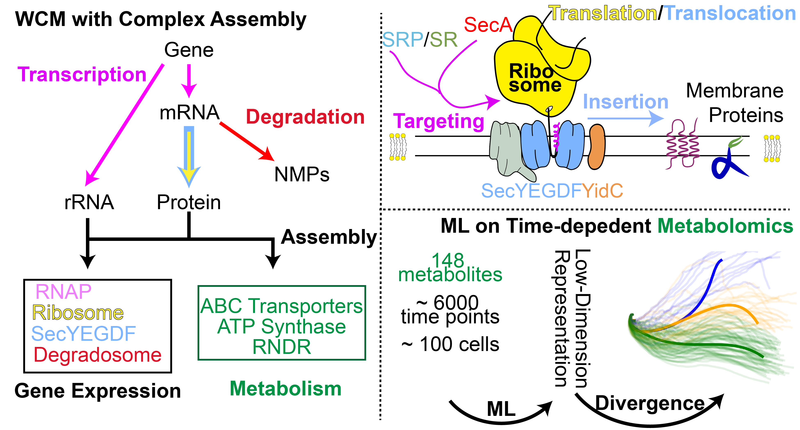

# CMEODE WCM of Minimal Cell with Complex Formation

Welcome to the GitHub repository for the **CMEODE whole-cell model (WCM)** of the minimal cell **Syn3A**, incorporating complex formation processes.

<p align="center">
  
</p>

---

## Required Programs

The following software packages are required to run the simulation:

- **[Lattice Microbes](https://github.com/Luthey-Schulten-Lab/Lattice_Microbes)**  
- **[odecell](https://github.com/Luthey-Schulten-Lab/odecell)**  
  > Install `odecell` in the *same conda environment* **after** building Lattice Microbes.

---

## Run the Simulation

To execute the parallel CMEODE simulation:

```bash
bash mpirun.sh
```

For a detailed explanation of parallel execution and simulation parameters, refer to `mpi_run.sh`.

---

## Programs and Scripts

### Main Driver

- `WCM_CMEODE_Hook.py` — Main script to launch the CMEODE simulation.

### Simulation Core

- `species_counts.py` — Class for managing species count data in the hook algorithm.
- `integrate.py` — Performs ODE integration.
- `initiation.py` — Initializes constants, time traces, and membrane state.
- `communicate.py` — Syncs CME and ODE states, computes costs, and updates the membrane.
- `hookSolver_CMEODE.py` — Defines `hookSimulation`, the main hook interval operation.
- `hook_CMEODE.py` — Manages operations that synchronize CME and ODE during hooks.
- `filesaving.py` — Exports time traces, surface area, and fluxes to CSV files.

### Biology Modules

- `rxns_CME.py` — Adds genetic information process (GIP) reactions to CME (e.g., replication, transcription, translation, tRNA charging).
- `cme_complexation.py` — Adds protein complex formation reactions to CME.
- `rxns_ODE.py` — Builds the ODE system using `odecell`.
- `replication.py` — Defines DNA replication initiation and reactions.
- `GIP_rates.py` — Computes reaction rates for GIP processes.

---

## Output Trajectories

Each simulation replicate with index *i* generates:

- `counts_i.csv`: Species count trajectories (units: molecules).
- `SA_i.csv`: Surface area (nm² or m²) and volume (L) trajectories.
- `Flux_i.csv`: Fluxes through ODE reactions (units: mM/s).
- `log_i.txt`: Log file with timestamps, printed reactions, run times, and any warnings/errors.

> Output files are saved to directories defined in `mpirun.sh`. They will be created if they do not exist.

Typical CSV file size ranges from **100–200 MB** for a 6000 s simulation with 1 s hook intervals.

---

## Input Files

- `syn3A.gb` — GenBank file of JCVI-Syn3A ([NCBI Accession: CP016816](https://www.ncbi.nlm.nih.gov/nuccore/CP016816)).
  - Encodes genome sequence, segmentation, and gene annotations.
<!-- - **Usage**: Read once at the beginning. Parsed by `mapDNA` in `initiation.py` to build the `genome` dictionary for use in CME reactions (`rxns_CME.py`). -->

- `Syn3A_updated.xml` — Includes metabolites, compartments, reactions, and gene associations.
  - Updated SBML model from [*eLife*, 2019](https://elifesciences.org/articles/36842).

<!-- - **Usage**: Read during ODE construction (`rxns_ODE.py`) every `hookInterval`. -->


- `initial_concentration.xlsx` — Provides initial conditions for proteins, medium, and metabolites.
  - **Sheet breakdown**:
  - **Comparative Proteomics**: Protein initial counts for CME.
  - **Simulation Medium**: Medium composition for simulation.
  - **Intracellular Metabolites**: Metabolite concentrations in cytoplasm.
  - **protein_metabolites**: Protein metabolite IDs used in `initiation.py` and `rxns_ODE.py`.

<!-- > The "Experimental Medium" sheet is included but unused. -->

- `kinetic_params.xlsx` — Contains kinetic parameters for ODE reactions and tRNA charging.
  - **Sheet Breakdown:**
  - **Central, Nucleotide, Lipid, Cofactor, Transport**: Random binding + convenience rate law reactions (`rxns_ODE.py`).
  - **Non-Random-binding Reactions**: Passive transport and serial phosphorelay reactions (`rxns_ODE.py`).
  - **tRNA Charging**: Aminoacylation parameters (`rxns_CME.py`).
<!-- > Other sheets (e.g., from `kinetic_params_10thSeptember.xlsx`) are **not used**. -->

- `complex_formation.xlsx` — Defines the composition of protein complexes.

<!-- **Sheet Breakdown:** -->
<!-- - **Complexes**: Complex components, pathways, initial counts, and PDB info. -->


- `avg_mRNACount.xlsx` — Contains averaged **steady-state mRNA counts** for each gene.
<!-- - Previous name: `avg_mRNACount_30thAugust_1200_1800.xlsx`. -->

- `oneParamMulder-local_min.json` — JSON-formatted **ribosome SSU assembly kinetics**
  - From [Earnest et al., 2015](https://www.sciencedirect.com/science/article/pii/S0006349515007651).

- `ribo_assembly.xlsx` — LSU and SSU ribosomal subunit assembly pathways with rates.
