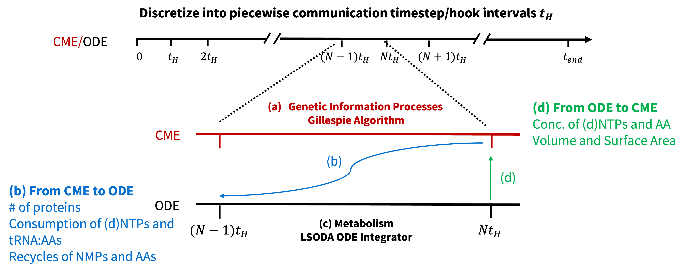
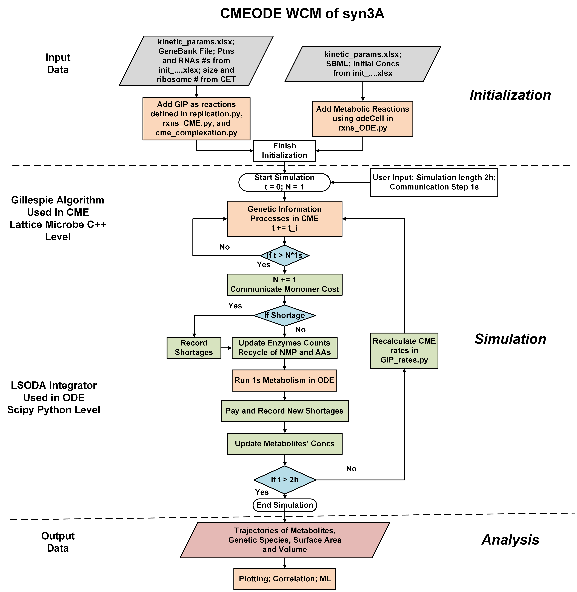

# Spatially homogeneous WCM of Minimal Cell with Macromolecular Complex Formation

Welcome to the GitHub repository for the **Spatially homogeneous whole-cell model (WCM)** of the genetically minimal cell **Syn3A**, incorporating complex formation processes!

<!-- <p align="center">
  
</p> -->

---

## Required Programs

The following software packages are required to run the simulation on Linux platforms:

- **[Lattice Microbes](https://github.com/Luthey-Schulten-Lab/Lattice_Microbes)**  
- **[odecell](https://github.com/Luthey-Schulten-Lab/odecell)**  
  > Install `odecell` in the *same conda environment* **after** building Lattice Microbes.

---

## Run the Simulation in Parallel

The CME/ODE simulations can be efficiently parallelized across up to 25 cell replicates or more, with each replicate requiring less than 2GB of RAM. On systems equipped with Intel Xeon Gold 6154 CPUs @ 3.00 GHz or AMD EPYC 7763 “Milan” processors, the parallel simulations of 2 biological hours with communication step of 1 s typically complete within 6 hours.

To execute the parallel CMEODE simulation:

```bash
bash mpirun.sh
```

For a detailed explanation of parallel execution and simulation parameters, refer to `./programs/mpi_run.sh`.

---

## Hybrid Stochastic/Deterministic Algorithm

The discreteness and stochasticity of chemical kinetics play a role when the number of reactants is significantly low. This makes it necessary to use stochastic chemical master equation (CME) for genetic information processes (GIP) where the copy numbers of species are low, shown as follows to sample the variation. In contrast, ordinary differential equations (ODE) is sufficient to depict the kinetics of large numbers of small metabolites in metabolism.

$\frac{dP(\mathbf{x},t)}{dt}=\sum_{r}^{R} [-a_r({{\mathbf{x}}}) P({{\mathbf{x}}},t) + a_r({{\mathbf{x}}}_\nu-\mathbf{S_r}) P({{\mathbf{x}}}-\mathbf{S_r},t)]$

To simulate the **co-evolution** of GIP and metabolism, the communication needs to be performed to describe the interactions between these two subsystems. We first discretize the entire simulation length into piecewise communication time steps (hook intervals, $t_H$). During each communication time step, 

**(a)** A CME simulation of length $t_H$ is performed to describe the kinetics in GIP. 

**(b)** The communication from CME to ODE by passing the protein counts, the consumption of monomers (dNTP, NTP, and amino acid charged tRNAs), and the recycling of nucleoside monophosphates (NMP) in the degradation of mRNA and recycling of amino acids in the degradation of membrane protein. 

**(c)** Then a $t_H$ length ODE simulation is performed with the updated concentrations of proteins and metabolites. 

**(d)** The impacts of metabolism on GIP are two-fold: the abundance of metabolites explicitly in GIP and the concentrations of monomers that affect the rates in the polymerization of gene, RNA, and protein.

<p align="center">
  
</p>

---

## Program Flowchart

The CME simulation is executed using Lattice Microbes (LM) with direct Gillespie algorithm. We employ the `hookSimulation` function to interrupt the CME timeline and enable communication with the ODE solver. For the ODE simulation, we use the **[odecell](https://github.com/Luthey-Schulten-Lab/odecell)** software developed by the Luthey-Schulten Lab, which maps metabolic reactions to ordinary differential equations and specifies the corresponding kinetic parameters. The resulting ODE system is solved using the *lsoda* algorithm from the SciPy library.

<p align="center">
  
</p>

---

##  Scripts

### Main Driver

- `WCM_CMEODE_Hook.py` — Main script to launch the CMEODE simulation.

### Simulation Core

- `species_counts.py` — Python Class for managing species count data in the hook algorithm.
- `integrate.py` — Performs ODE integration using *lsoda* from Scipy.
- `initiation.py` — Initializes constants, time traces, and cell membrane.
- `communicate.py` — Syncs CME and ODE states, computes costs, and updates the membrane.
- `hookSolver_CMEODE.py` — Defines `hookSimulation`, the main hook interval operation.
- `hook_CMEODE.py` — Manages operations that communicate CME and ODE during hooks.
- `filesaving.py` — Exports time traces, surface area, and fluxes to CSV files.

### Biology Modules

- `rxns_CME.py` — Adds genetic information process (GIP) reactions to CME (e.g., replication, transcription, translation, tRNA charging).
- `cme_complexation.py` — Adds protein complex formation reactions to CME.
- `rxns_ODE.py` — Builds the ODE system using `odecell` (metabolic parameters from `kinetic_params.xlsx`).
- `replication.py` — Defines DNA replication initiation and reactions (GIP parameter from `kinetic_params.xlsx`).
- `GIP_rates.py` — Computes reaction rates for GIP processes (GIP parameter from `kinetic_params.xlsx`).

---

## Input Files

- `syn3A.gb` — GenBank file of JCVI-Syn3A 
  - Obtained from ([NCBI Accession: CP016816](https://www.ncbi.nlm.nih.gov/nuccore/CP016816)).
  - Encodes genome sequence, segmentation, and gene annotations.

- `Syn3A_updated.xml` — Includes metabolites, compartments, reactions, and gene associations.
  - Updated SBML model from [*eLife*, 2019](https://elifesciences.org/articles/36842).
  - Standard file format in system biology.
  - Read in for Reaction and stoichiometries by `rxns_ODE.py`.


- `initial_concentration.xlsx` — Provides initial conditions for proteins, medium, and metabolites.
  -  Update from [*Cell*, 2022](https://www.sciencedirect.com/science/article/pii/S0092867421014884?via%3Dihub#da0010).
  - **Sheet breakdown**:
  - **Comparative Proteomics**: Protein initial counts for CME.
  - **Simulation Medium**: Medium composition for simulation.
  - **Intracellular Metabolites**: Metabolite concentrations in cytoplasm for ODE.
  - **mRNA count**: Initial average count of mRNAs for CME.
  - **Protein Metabolites**: Protein metabolite IDs used in `initiation.py` and `rxns_ODE.py`.


- `kinetic_params.xlsx` — Contains kinetic parameters for ODE reactions, tRNA charging, and gene expression
  - Update from [*Cell*, 2022](https://www.sciencedirect.com/science/article/pii/S0092867421014884?via%3Dihub#da0010).
  - **Sheet Breakdown:**
  - **Central, Nucleotide, Lipid, Cofactor, Transport**: Random binding + convenience rate law reactions (`rxns_ODE.py`).
  - **Non-Random-binding Reactions**: Passive transport and serial phosphorelay reactions (`rxns_ODE.py`).
  - **tRNA Charging**: Aminoacylation parameters (`rxns_CME.py`).
  - **Gene Expression**: Parameters in gene expression (`rxns_CME.py`, `replication.py`, and `GIP_rates.py`)
  - **SSU Assembly, LSU Assembly**: Reactions and rates of SSU and LSU assembly

- `complex_formation.xlsx` — Defines the composition and initial counts of protein complexes.

---

## Output Files

Each simulation replicate with index *i* generates:

- `counts_i.csv`: Species count trajectories of metabolites from ODE and genetic particles from CME (units: molecules).
- `SA_i.csv`: Surface area (nm$^2$ or m$^2$) and volume (L) trajectories.
- `Flux_i.csv`: Fluxes through ODE reactions (units: mM/s).
- `log_i.txt`: Log file with timestamps, printed reactions, run times, and any warnings/errors.

Output files are saved to directories defined and created in `mpirun.sh`.

Typical CSV file size ranges from **100–200 MB** for a 7200 s simulation with 1 s hook intervals.